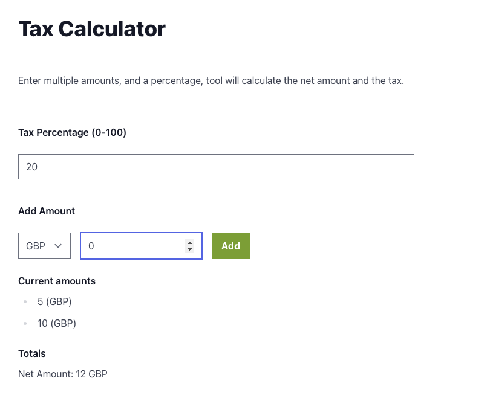

# Onsi Pair Programming Exercise

This exercise is designed as a pair programming session. Here are some key points to keep in mind:

- We're here to collaborate, not to judge. Feel free to think out loud, ask questions, and share your thoughts.
- Don't hesitate to seek clarification or assistance. We're here to support you throughout the process.
- This is a conversation as much as it is a coding exercise. We want to see how you approach problems and communicate your ideas.

## Context

Let's set the scene: We're working through our codebase and we've stumbled upon this legacy tax calculator (`TaxCalculator.tsx`). While it's functional and has tests in place, the code is quite messy and could use some improvements. Our task is to refactor this code, considering the following:

1. Improve overall structure and readability
2. Better handle edge cases
3. Enhance maintainability for future updates

We'll be working on this together for a 30-minute time box. The goal is not necessarily to complete everything, but to make meaningful progress and demonstrate your problem-solving approach.

Remember, we're more interested in your thought process and how you communicate your ideas than in achieving a perfect solution in the limited time.

Let's dive in and see how we can improve this tax calculator together.

## Get Started

Before we get started, please make sure you've done the following steps:

- `npm install`
- `npm run dev` to run in your browser
- `npm run test` to make sure your tests pass
